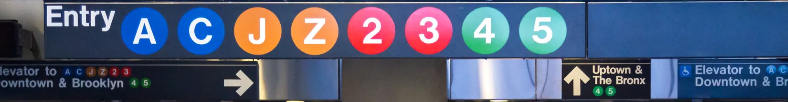

# Top 10 Stations for MTA Advertising
###### METIS Data Science and Machine Learning Bootcamp 2022 by Krystian Krystkowiak
###### project/month(1/7) focus: EXPLORATORY DATA ANALYSIS
#### Code [GitHub](https://github.com/Krystkowiakk/Metis-Project-1-EDA-on-MTA/blob/372cfd21b3e998a53f0f57ddaba1de06e52a37d3/METIS_Krystkowiak_Krystian_Project_1_EDA.ipynb)
#### Presentation [GitHub](https://github.com/Krystkowiakk/Top-10-Stations-for-MTA-Advertising/blob/372cfd21b3e998a53f0f57ddaba1de06e52a37d3/Project%20Presentation/METIS_Krystkowiak_Krystian_Project_1_EDA.pdf)

ABSTRACT
- Utilized MTA turnstile data to identify optimal locations for Christmas advertising campaign in New York.
- This project aims to identify the top 10 stations for MTA advertising in New York City during the September to December 2022 period. To do this, I analyzed MTA turnstile data from three different time periods: September to December 2021, January to May 2022, and September to December 2019. By processing and manipulating the data with tools such as SQL, SQLite, SQLAlchemy, NumPy, and Pandas, I was able to identify the top 10 stations based on daily entrances. I then communicated my findings through a slide presentation using Matplotlib and Seaborn for visualization.

DESIGN

- Gather MTA turnstile data from three different time periods: September to December 2021, January to May 2022, and September to December 2019.
- Import and clean the data as needed.
- Process the data to get daily entrance numbers for each turnstile.
- Identify the top 10 stations based on daily entrances.
- Visualize and communicate the findings through a slide presentation.

The goal of this project was to provide MTA with recommendations for their new experimental advertising panels, which are set to be installed in September 2022.

DATA

The data for this project was obtained from the MTA's website (http://web.mta.info/developers/turnstile.html). It consists of information on entry and exit counts for each MTA turnstile at a particular control area, recorded at 4-hour intervals. The data set covers three time periods: September to December 2021, January to May 2022, and September to December 2019. The data from September to December 2019 was included in the analysis as it represents traffic data from before the COVID-19 pandemic, which may provide additional context on typical station traffic.

ALGORITHMS

Import, clean, and manipulate the MTA turnstile data. This involved processing the data to calculate daily entrance numbers for each turnstile, which allowed for the analysis of traffic at different stations and the identification of the top 10 stations.

TOOLS

- SQL and SQLite for initial data exploration
- SQLAlchemy for importing the data into Pandas
- NumPy and Pandas for data manipulation
- Matplotlib and Seaborn for visualization and creating plots for the presentation

COMMUNICATION

5-minute slide presentation.
The presentation was designed to clearly convey the findings of the analysis and provide recommendations for the placement of the new experimental advertising panels.

